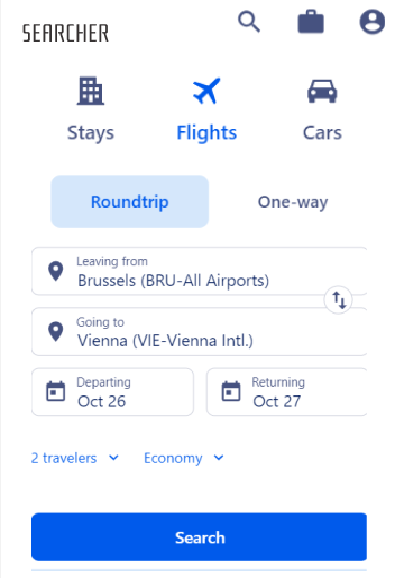
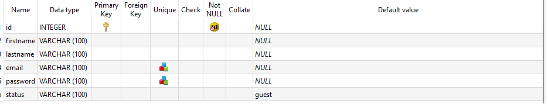
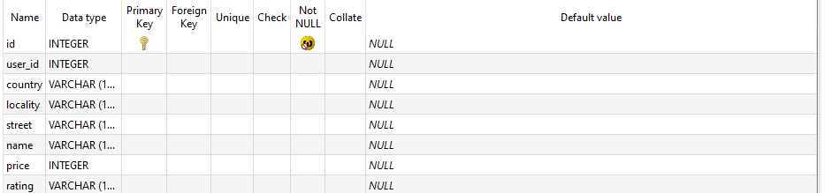
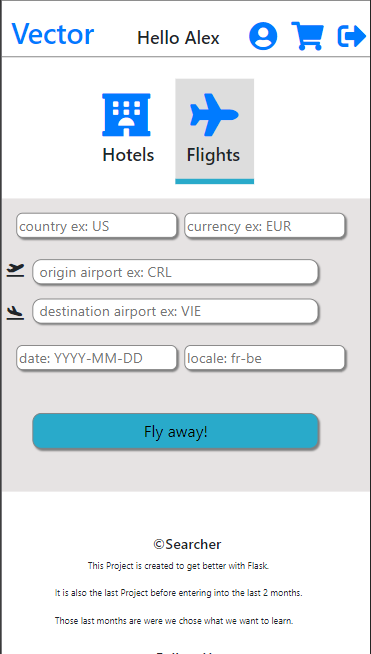
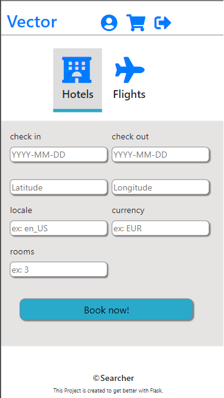
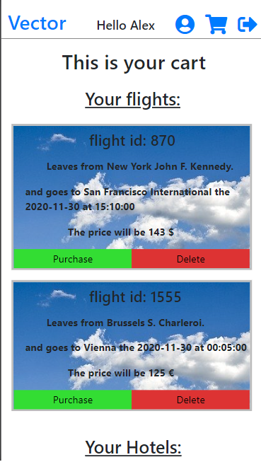

# Np_Project_Flask

- Repository: `OOP`
- Type de challenge:  `Consolidation`
- Durée: `4 semaines`
- Deadline: `16/11/20 9 A.M.`
- Déploiement :
	- Github page
	- Heroku
	- Heroku + remote DBA
	- self-hosting
	- ...
- Team challenge :  `solo`
- [project objectives link](https://github.com/becodeorg/BXL-Swartz-3-21/tree/master/09-OOP-npProject)

## My Project
For this project I will be doing a Tourist site that will look up flights and hotels and compare the prices.   
I will use, Flask for the backend.  
It will be my first project with flask.

## My Figma  

## My Model

## Used languages

- Html
- Css
- Python (flask)

## Frameworks

- Bootstrap

## API

I used rapidApid with those 2:

- for the flights, skyscanner: https://rapidapi.com/skyscanner/api/skyscanner-flight-search
- for the hotels, hotels.com: https://rapidapi.com/yahoo.finance.low.latency/api/hotels-com-free

## Databases
I used SQLite with SQLAlchemy:  

- This table is for the users:  

- This table is for the flights:  

- This table is for the hotels:

## Some Screenshots of the site:

## Hope you enjoy it!

